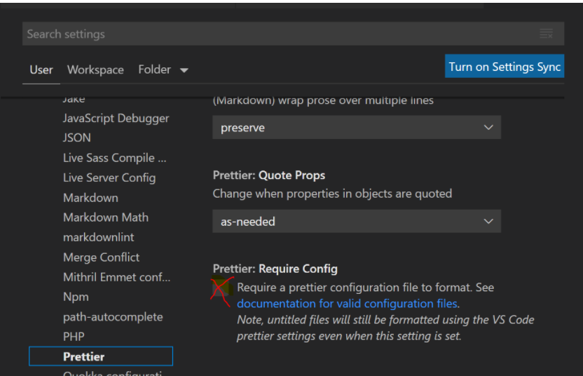
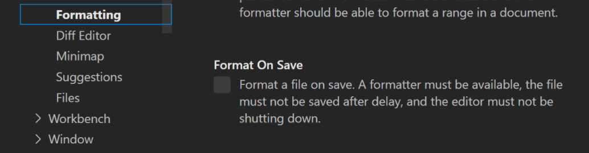

# ESLint, Prettier, Husky et Lint-staged

`ESLint` analyse statiquement notre code pour trouver les problèmes.

`Prettier` va formater notre code en suivant des règles prédéfinies.

`husky` permet d'utiliser les githooks comme s'il s'agissait de scripts npm.

`Lint-staged` nous permet d'exécuter des scripts sur des fichiers `staged` (ajouté à Git avec git add …, mais pas encore commit) dans Git.

Le but de ces 4 outils est qu'ils travaillent ensemble afin de fournir un code de qualité et déviter les conflits lorsque l'on travail en équipe.

## Résumé des actions

- installation dans VS Code de l'extension `ESLint` et `prettier Code formatter`

- Création d'un projet React avec `Create-react-app`

- `npm install --save-dev --save-exact prettier`

- Création du fichier `.prettierrc.json`

- Création du fichier `.prettierignore`

- `npm install --save-dev eslint-config-prettier`

- Ajouter `prettier` dans `"eslintConfig"` du `package.json`

- Changer `Prettier: require config` dans les `settings` de VS Code

- `npx mrm@2 lint-staged`

## ESLint

Si on utilise `Create React App` pour créer notre projet `Eslint` est automatiquement installé. Nous pouvons le voir dans le fichier `package.json` :

````json
"eslintConfig": {
    "extends": [
      "react-app",
      "react-app/jest"
    ]
  },
````

Afin de voir directement les erreurs dans notre éditeur (VS Code pour moi) on doit aussi installer l'extension `EsLint` dans VS Code.

Si on utilise pas `Create React App` il faudra installer ESLint comme indiquer dans la doc : <https://eslint.org/docs/user-guide/getting-started>

## Prettier

Il est important d' installer `Prettier` localement dans chaque projet, afin que chaque projet reçoive la bonne version de `Prettier`.

<https://prettier.io/docs/en/install.html>

Contrairement à `Eslint`, `Prettier` n'est pas installé de base avec `Create React App`.

````shell script
npm install --save-dev --save-exact prettier
````

puis création de deux fichiers à la racine du projet :

`.prettierrc.json`et `.prettierignore`

````javascript
// .prettierrc.json
{
  "arrowParens": "avoid",
  "bracketSpacing": false,
  "endOfLine": "lf",
  "htmlWhitespaceSensitivity": "css",
  "insertPragma": false,
  "bracketSameLine": false,
  "jsxSingleQuote": false,
  "printWidth": 80,
  "proseWrap": "always",
  "quoteProps": "as-needed",
  "requirePragma": false,
  "semi": false,
  "singleQuote": true,
  "tabWidth": 2,
  "trailingComma": "all",
  "useTabs": false
}
````

````javascript
// .prettierignore 
node_modules
coverage
build
````

Commandes utiles :

````shell script
npx prettier --write . # on peut formater tous les fichiers avec Prettier
npx prettier --write app/ # formater que le dossier app
npx prettier --write app/components/Button.js
npx prettier --check . # vérifie seulement que les fichiers sont déjà formatés, plutôt que de les écraser
````

---

> Si on souhaite activer et désactiver le formatage de `Prettier` on peut installer dans VS Code l'extension : `Formatting Toggle`
> On pourra cliquer en bas à droite dans la barre de tache sur `Formatting`

## ESLint avec Prettier

Surtout utile si on modifie `ESLint` avec des règles qui rentrent en conflit avec les règles de `Prettier` ou que l'on importe une config `ESLint` populaire comme `eslint-config-airbnb` <https://www.npmjs.com/package/eslint-config-airbnb> déjà configuré.

Pour éviter tout conflit entre `ESLint` et `Prettier` <https://github.com/prettier/eslint-config-prettier#installation>

````shell script
npm install --save-dev eslint-config-prettier
# pour désactive toutes les règles inutiles ou susceptibles d'entrer en conflit avec Prettier .
````

Ensuite, ajoutez `prettier`au tableau "extends" dans votre fichier `package.json`. Assurez-vous de mettre `prettier` en dernier, afin qu'il ait la possibilité de remplacer quelques règles des autres configurations.

````JSON
"eslintConfig": {
    "extends": [
      "react-app",
      "react-app/jest",
      "prettier"
    ]
  }
````

Dans VS Code on peut demander un formatage du code que si un fichier de config existe :



on peut aussi demander que le formatage soit fait quand on sauvegarde :



Pour le moment je formate le code avec `prettier` manuellement avec `ALT` + `MAJ` + `f`

## Husky avec Lint-staged

<https://github.com/okonet/lint-staged#what-commands-are-supported>

Ces deux outils nous permettent de formater notre code chaque fois que nous faisons un `commit` dans Git. Cela évitera de `commit` du code non formater et non analysé.

La commande suivante installera et configurera `husky` et `lint-stage` en fonction des outils de qualité de code que nous avons installé dans les `devDependencies` du fichier `package.json`. Les outils de qualité de code que nous avons installé sont `ESLint` et `Prettier`.
🚨 Il faut lancer cette commande uniquement après avoir installé `ESLint` et `Prettier`
<https://github.com/okonet/lint-staged#what-commands-are-supported>

````shell script
npx mrm@2 lint-staged
````

Cela va créer un dossier `.husky` a la racine de notre projet et modifier notre `package.json` en rajoutant un script :

````shell script
"scripts": {
   #...
    "prepare": "husky install"
  }
````

Ainsi que :

````shell script
"lint-staged": {
    "*.{js,css,md}": "prettier --write"
  }
  #"src/**/*.{js,jsx,ts,tsx,json,css,scss,md}":
````

 <https://medium.com/@okonetchnikov/make-linting-great-again-f3890e1ad6b8>

 <https://github.com/okonet/lint-staged>
